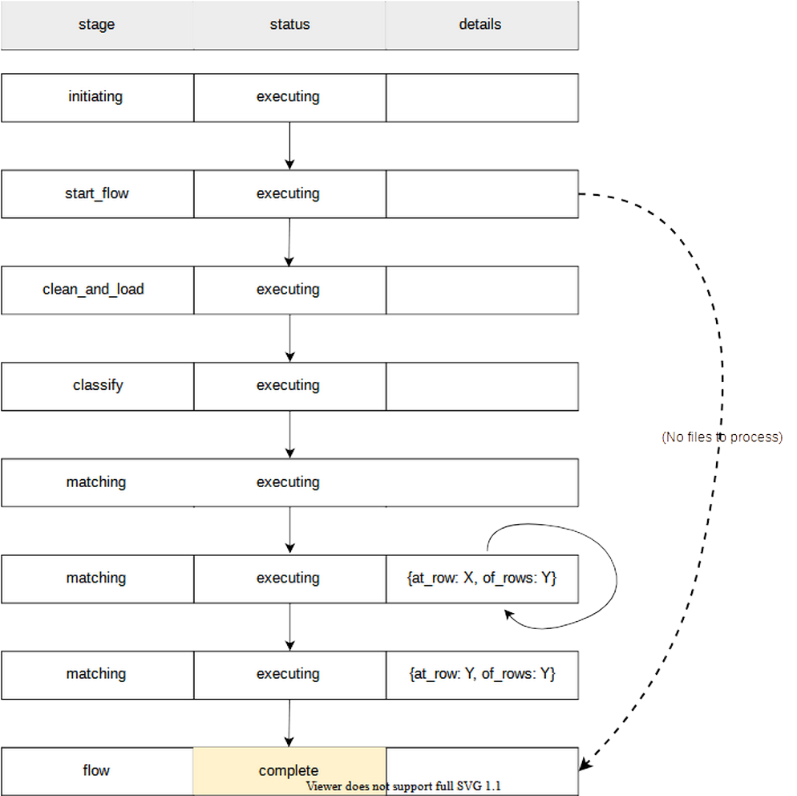

# Data Flow

[flow chart](https://app.lucidchart.com/invitations/accept/0602fccf-18f9-48d4-84ff-ffe5f0b03e7a)

**ShelterLuv People**: This data is being pulled via a script that calls ShelterLuv and saves data as a csv into a Dropbox folder via an "app". It is set up to use config + cron job, although this is not yet active in deployment. Every time it pulls data, it pulls everything because the API doesn't support pagination. To configure automation, the config file needs to contain the app ID
